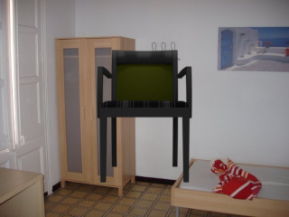
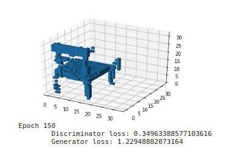
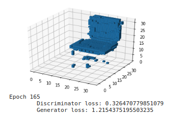
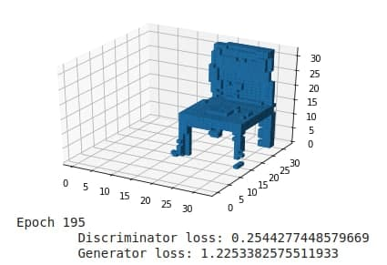

# 3D-VAE GAN

## Команда

Воробьев Тихон, Гераськин Ярослав

## Описание проекта

Генерация трехмерных стульев в воксельном представлении на основе результатов статьи [Learning a Probabilistic Latent Space of Object Shapes via 3D Generative-Adversarial Modeling](https://arxiv.org/pdf/1610.07584.pdf).

## Проделанная работа

1. Имплементированы модели генератора и дискриминатора, описанные в статье.
2. Реализована в измененном виде модель инкодера.
3. Разобрана структура датасета ShapeNet. Из него были взяты только воксельные представления стульев (889 различных моделей в 12ти ориентациях) в силу ограничений в вычислительных ресурсах.
4. Обучен 3D-GAN, который иногда генерирует что-то сильно похожее на стулья.
5. Обучен 3D-VAE-GAN, где в качестве изображения стула, рассматривалась конкатенация его трех проекций на стороны куба.
6. Спроецировано латентное пространство (двухсот мерное) на плоскость. Получился плохой результат, нет явных паттернов, из чего можно сделать вывод, что либо было сделано недостаточное количество эпох, либо слишком большой вес у KLD loss.
7. Сгенерирован датасет на основе датасета [ShapeNet](https://shapenet.org/), исходный датасет содержит 3d модели стульев, нам нужны их воксельные представления и изображения стульев для энкодера, для получения изображений исходные модели стульев рендерятся на фоновых изображениях из датаесте [SUN](https://groups.csail.mit.edu/vision/SUN/hierarchy.html)
8. Обучена модель с [spectral_norm](https://arxiv.org/abs/1802.05957) в дискриминаторе, функция потерь заменена на [Hinge loss](https://arxiv.org/pdf/1705.02894v2.pdf)

Пример изображения для энкодера:

Пример результатов модели с Hinge loss и spectral normalization:

## Предстоящая работа

1. В статье сделано интересное предположение о том, что хороший дискриминатор является хорошим классификатором. Хочется проверить это предположение.
2. Обучить модель с энкодером на отрендеренных стульях
3. Попробовать обучить больше эпох.

## Ссылка на код

[рабочая версия](https://colab.research.google.com/drive/1M8HrZ12AY7MStRwYQOKsde6miO6rGb_4?usp=sharing)

[финальная версия](https://www.youtube.com/watch?v=dQw4w9WgXcQ)
